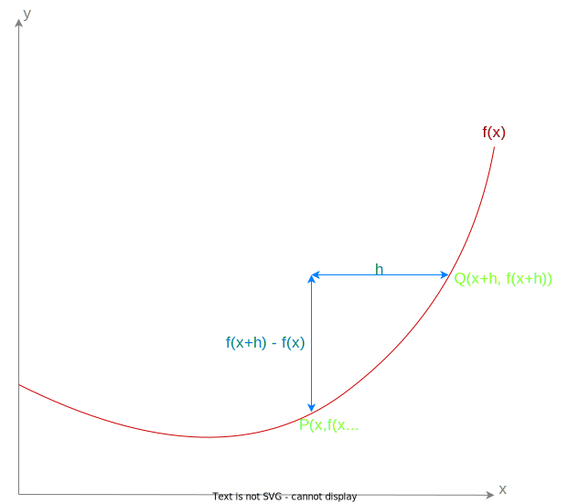

# Differentiation
For any equation in the form $y=f(x)$ where $f(x)$ is in the form $mx^k$, the gradient function, $\frac{dy}{dx}f(x)$ also known as $f'(x)$ is given by the formula $mkx^{k-1}$.

## A proof from first principles

The gradient of the chord formed between **P** and **Q** is $\frac{f(x+h)-f(x)}{h}$.

As $h \rightarrow 0$, this gradient more closely approximates teh gradient of the line formed by $f(x)$ at the point **P**.

Therefore, the gradient function $f'(x)$ is equal to:

$f'(x) = \lim_{x\rightarrow 0}\frac{f(x+h)- f(x)}{h}$