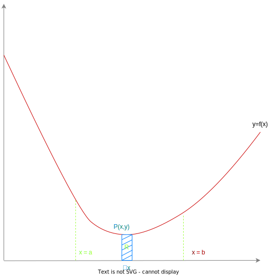

# Integration
Integration is the reverse process of differentiation.

Consider the area of the region **R** bounded by the curve $y=f(x)$, the x-axis and the lines $x=a$ and $x=b$ as shown below:

As the rectangle with base $\delta x$ is repeated along the $x$ axis to fill area **R**.

$\lim_{\delta x \rightarrow 0}\sum^{x=b}_{x=a} y \delta x \approx R_{area}$

This notation is commonly shortened to:

$\int^{b}_{a}(y)dx$

## Types of integrals
To perform an integral on a polynomial of the form $kx^n$:

### Definite integral  

$\int (kx^n)dx = \frac{k}{n+1}x^{n+1} + C$

### Indefinite integral 

$\int^a_b (kx^n)dx = [\frac{k}{n+1}x^{n+1}]^a_b$

For the indefinite integral, $ b < a$.

### The difference between types of integrals:
- A definite integral has bounds, and thus, the results of a definite integral are a single number, obtained by taking the result of the integrated formula when the upper bound is used as x, and subtracting the lower bound when used as x.
- Definite integrals are generally used when you want to find the area under some function $y =f(x)$ between a given bounds.
- An indefinite integral results in a formula with an extra unknown, $C$, this value is equal to the y intercept of the resulting function. This artifact of integrating is left over because after integrating, there may be many equations of the form provided that satisfy the conditions.

