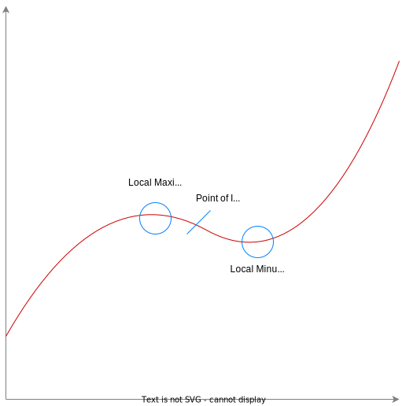

# Stationary Points, Turning Points and Points of Inflection
Consider the cubic $y=f(x)$

### Points of Inflection / Turning Points
A point of inflection is where the gradient changes from decreasing to increasing of vice versa. Though points of inflection are often on turning points, they are often not, especially on polynomials of an odd degree.

At points of inflection, $\frac{d^2y}{dx^2} = 0$ and $\frac{d^3y}{dx^4} \neq 0$.

### Stationary Points
At a stationary point, $f'(x) = 0$. That's about it.

### What the function is doing
If at a point $x$, $f'(x) \geq 0$ it can be said that the function is increasing at that point. Conversely, if $f'(x) \leq 0$, $f(x)$ can be said to be decreasing.