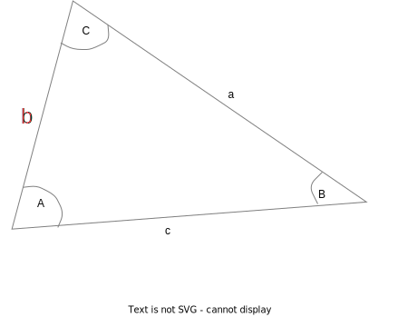

# Trigonometric rules
The following rules work for any triangle, where the sides and angles are labeled as below:

## Sine Rule
$\frac{a}{\sin A} = \frac{b}{\sin B} = \frac{c}{\sin C}$

$\frac{\sin A}{a} = \frac{\sin B}{b} = \frac{\sin C}{c}$ 

## Cosine Rule
$a^2 = b^2 + c^2 - 2bc\cos{A}$

$\frac{b^2 + c^2 - a^2}{2bc} = \cos{A}$ 

## Area of any triangle
$A_{rea} = \frac{1}{2}ab\sin{C}$