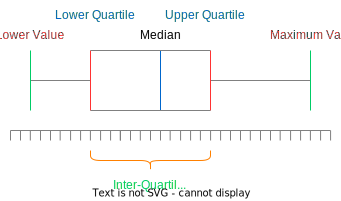

# Box Plots and Outliers

## Box plots
A quick recap of box plots  

## Outliers
In general, an outlier is a value that lies 1.5 Inter-quartile ranges beyond the upper and lower quartiles. If there is a deviation from this, it will be specified in the question.

